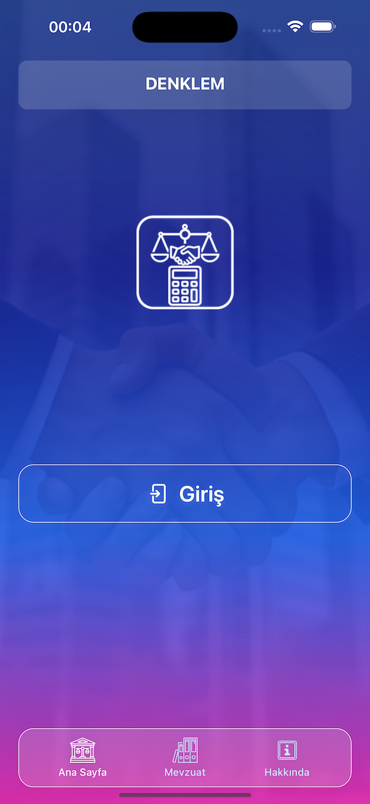

<h1 align="center">
  
</h1>

  <em>15+ years in law. 8+ years in mediation. Now building the tools I wish existed.</em>

  
  

---

### About

I'm a practicing lawyer and mediator based in Turkey. After years of manually calculating mediation fees and navigating fragmented legal tools, I decided to build what the profession needed — starting with **Denklem**.

I'm not a career developer. I'm a domain expert who writes code to solve real problems in the legal field. Everything I build is **free, open-source, ad-free, and collects zero user data**.

---

### Denklem — Mediation Fee Calculator

  

 

  
  
  

 

A native iOS app for Turkish lawyers and mediators to calculate official mediation fees instantly.

- **Built with** Swift & SwiftUI
- **Multi-language** — Turkish, English, Swedish
- **Privacy-first** — No analytics, no tracking, no ads
- **Open-source** — MIT licensed, contributions welcome

> *Built by a mediator, for mediators.*

---

### Built With

  
  
  
  
  

---

### GitHub Stats

  
  

  

---

  <em>"I saw a problem in my profession. I built the solution. I made it free."</em>

