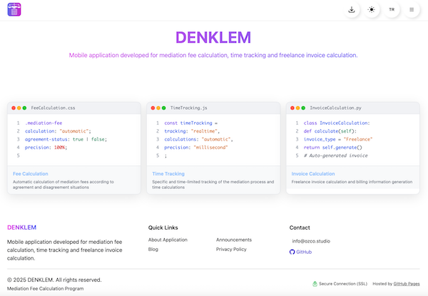

### Hi there 👋

Welcome to my GitHub profile! I'm on an exciting journey of learning and building software applications. Check out my work:

### 🚀 My Projects & Websites

  <table>
    <tr>
      <td align="center" width="33%">
        
         
        <strong>Portfolio Website</strong>
         
        <a href="https://ozco.studio">ozco.studio</a>
      </td>
      <td align="center" width="33%">
        
         
        <strong>Denklem Website</strong>
         
        <a href="https://denklem.org">denklem.org</a>
      </td>
      <td align="center" width="33%">
        
         
        <strong>Denklem App</strong>
         
        <a href="https://apps.apple.com/tr/app/denklem/id6746580824">App Store</a>
      </td>
    </tr>
  </table>

---

### 🌟 Languages and Tools I Use:

 
 
 

---

### 🛠️ Current Focus:

- 
- 
---

### 🚀 Current Goals:
- Build real-world applications in Python, Java, and Flutter.
- Learn and master GitHub for version control and collaboration.
- Connect with like-minded individuals who are willing to share their knowledge and experience.
- **Create open-source and free projects that benefit humanity.**

---
### 🌟 Featured Projects:
- **[Denklem - Mediation Fee Calculator](https://github.com/ozcotech/DENKLEM):** A comprehensive Python-based app to calculate mediation fees. Currently adding English language support, voice-over accessibility features for visually impaired users, and planning to implement liquid glass UI design in early 2026.
- **[Portfolio Website](https://ozco.studio):** My personal portfolio website showcasing my projects and skills.
- **Barber Appointment System:** Developing a mobile application for barber shop appointment management (upcoming project).
- **Swift iOS Applications:** Learning and developing native iOS applications using Swift.
---

### 💡 How You Can Help:
I'm always open to learning and growing. If you:
- Have advice, tips, or mentorship to offer, I'd love to hear from you.
- Are interested in collaborating on projects, let's connect.
- Can share resources or guidance, feel free to reach out.

---
### 📊 GitHub Stats:

---

### 📬 Let's Connect:
You can reach me through:
- **GitHub:** [ozcotech](https://github.com/ozcotech)
- **Email:** info@ozco.studio

---

### ✨ Fun Fact:
Did you know? The first computer programmer was Ada Lovelace in the 19th century!

---

Thank you for visiting my profile! 😊 Let's create something amazing together! ✨
